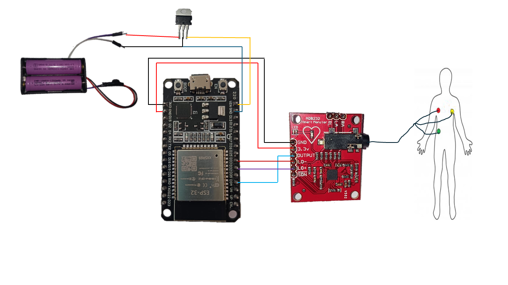
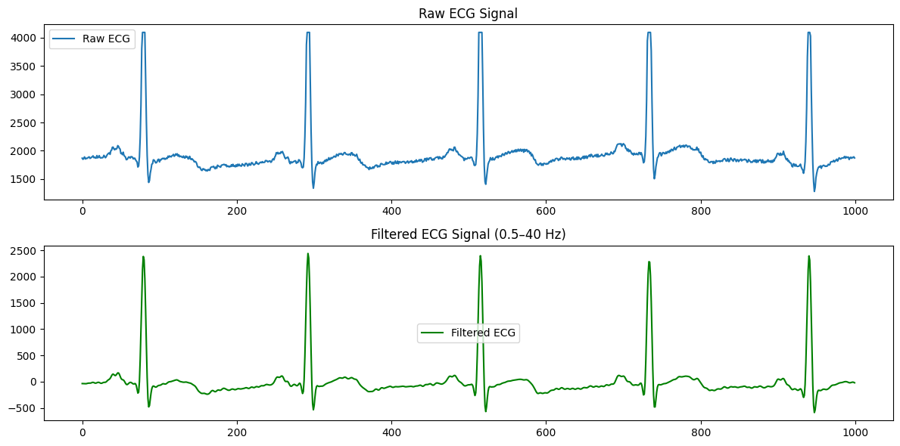

# Real-Time IoMT ECG Monitoring System Using AD8232 and ESP32


## Overview

This project presents a real-time Internet of Medical Things (IoMT) based ECG monitoring system using the AD8232 ECG sensor and ESP32 microcontroller. The system continuously acquires ECG signals, transmits them wirelessly over Wi-Fi, performs digital signal processing on a host computer, calculates heart rate, and visualizes the processed ECG waveform through a web-based dashboard.

## Features

* Real-time ECG signal acquisition using AD8232
* Wireless ECG data transmission via ESP32 Wi-Fi
* DC offset removal
* Band-pass filtering
* Signal normalization
* R-peak detection
* Real-time heart rate estimation
* Flask-based web dashboard
* Live ECG waveform visualization

---

## System Architecture

### Sensing Layer

* AD8232 ECG Sensor
* ECG Electrodes
* ESP32 Microcontroller

### Communication Layer

* Wi-Fi Communication
* TCP/IP Data Transfer

### Processing Layer

* Signal Acquisition
* Digital Signal Processing
* Heart Rate Calculation

### Application Layer

* Flask Web Server
* Real-Time Dashboard
* ECG Visualization

---

## Hardware Components

| Component               | Purpose                                  |
| ----------------------- | ---------------------------------------- |
| ESP32 Development Board | Data acquisition and Wi-Fi communication |
| AD8232 ECG Sensor       | ECG signal measurement                   |
| ECG Electrodes          | Bio-signal collection                    |
| Computer/Laptop         | Signal processing and visualization      |

---

## Software Stack

### Embedded Side

* MicroPython
* ESP32

### Server Side

* Python
* Flask

### Signal Processing

* NumPy
* SciPy
* Pandas

### Communication

* WebSockets

### Visualization

* HTML
* JavaScript
* Matplotlib

---

## Repository Structure

```text
.
├── README.md
├── main.py
├── pc_server.py
├── index.html
└── images/
```

---

## System Workflow

```text
AD8232 ECG Sensor
        │
        ▼
      ESP32
        │
   Wi-Fi Transfer
        │
        ▼
   pc_server.py
        │
        ├── DC Offset Removal
        ├── Band-Pass Filtering
        ├── Normalization
        ├── R-Peak Detection
        └── BPM Calculation
        │
        ▼
    Flask Server
        │
        ▼
     index.html
        │
        ▼
 Real-Time ECG Dashboard
```

---

## Installation

### Clone Repository

```bash
git clone https://github.com/Alokshukla18/ECG_Project.git
cd YOUR_REPOSITORY
```

### Install Required Packages

```bash
pip install flask numpy scipy pandas websockets matplotlib
```

Or using requirements.txt:

```bash
pip install -r requirements.txt
```

---

## Running the Project

### Step 1: Start the Server

Run the processing and Flask server first:

```bash
python pc_server.py
```

The server will:

* Start Flask on port 5000
* Wait for ECG data from ESP32
* Process incoming ECG samples
* Calculate heart rate
* Serve data to the dashboard

---

### Step 2: Upload and Run ESP32 Code

Upload `main.py` to the ESP32.

Configure:

* Wi-Fi SSID
* Wi-Fi Password
* Server IP Address

After connecting to Wi-Fi, the ESP32 will begin transmitting ECG data to the server.

---

### Step 3: Open the Dashboard

Open your browser and navigate to:

```text
http://localhost:5000
```

You should see:

* Live ECG waveform
* Processed ECG signal
* Heart Rate (BPM)
* Real-time monitoring dashboard

---

## Signal Processing Pipeline

### 1. DC Offset Removal

Removes baseline drift and unwanted DC components from the ECG signal.

### 2. Band-Pass Filtering

Reduces:

* Motion artifacts
* High-frequency noise
* Electrical interference

while preserving important ECG features.

### 3. Signal Normalization

Scales ECG amplitudes to a consistent range for visualization.

### 4. R-Peak Detection

Detects QRS complexes to determine heart beats.

### 5. Heart Rate Estimation

Heart rate is calculated using RR intervals:

[
BPM = \frac{60}{RR\ Interval}
]

---

## Screenshots

### System Architecture



### ECG Dashboard


### Signal Processing Pipeline



---

## Applications

* Remote Patient Monitoring
* Telemedicine
* Healthcare IoT Research
* Biomedical Signal Processing
* Educational Projects

---

## Future Improvements

* Mobile Application Support
* Cloud Data Storage
* Multi-Patient Monitoring
* Arrhythmia Detection
* AI-Based ECG Classification
* Emergency Alert System

---

## Author

**Alok Kumar Shukla**

M.Sc. Physics
Dr. Harisingh Gour Vishwavidyalaya, Sagar, Madhya Pradesh, India

---

## License

This project is intended for educational and research purposes.
